# INF656-Final-Project - MEAN Stack Project

# PC Builder Web Application

This project is a full-stack web application based on my web development proposal, utilizing the MEAN stack (MongoDB, Express.js, Anguluar, and Node.js). The website is a platform designed to assist users in learning about, selecting, and building PCs. It provides a platform for beginners to enthusiasts alike to explore various features and services. Working on this project has allowed me to learn the fundamentals of full-stack web development as this project emphasizes back-end development.

## Features

- Interactive PC Builder to customze your computer build
- Shop Services to explore computer parts and pre-builds
- Educational Resources about computer parts, computers, and more
- User Registration to allow users to save their items
- Admin Dashboard, an interface-functionality for content management enabling CRUD operations
- RESTful API Endpoints for hanlding user interactions with the database (Registration)
- MongoDB database management for storing and retrieving information

## Built With

- Front-end: Angular framework, Bootstrap for styling, Font Awesome for icons
- Back-end: Express.js framework and Node.js runtime environment, Mongoose for MongoDB object modeling
- Database: MongoDB Atlas for cloud-based data storage
- JavaScript, HTML, CSS, TypeScript, and npm packages

## Setup and View

1. Clone the repository using: `git clone https://github.com/HernandezA1007/INF656-Final-Project.git`.
2. Navigate to the project directory and install the dependcies with: `npm install`.
3. Server the application locally using: `ngx ng serve` or `ng serve`.
4. Access the front-end by visiting: `http://localhost:4200` in your browser.

- If backend and frontend are not connected correctly for you, ensure the backend server is running on `http://localhost:3000`.

- Alternatively, a deployed version will be hosted: ... (not done)

## Development Roadmap

- [x] Project Proposal
    - [x] Review Proposal
    - [x] Planning and Design
- [x] Front-end (Angular)
    - [x] Develop user interface
    - [x] Implement Angular services (services, routing, form validation, erroring handling)
- [x] Back-end (Express.js and Node.js)
    - [x] Set up Node.js server
    - [x] Develop RESTful APIs using Express.js
    - [x] Integrate MongoDB for data storage and retrieval
    - [ ] Ensure API authentication and authorization
- [x] Database (MongoDB)
    - [x] Design the database schema
    [x] Implement CRUD operations for data models
- [x] Functionality Implementation
    - [x] Reflect on functionalities mentioned in proposed and implement them
    - [x] Ensure application aligns with user experience and interactions planned
- [ ] Deployment

## Gallery

(inserting screenshots, reorganize later)

initial design of the website

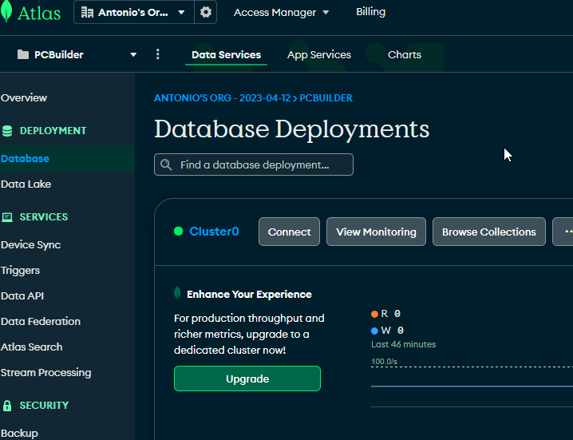

Basic front end design:
Home page
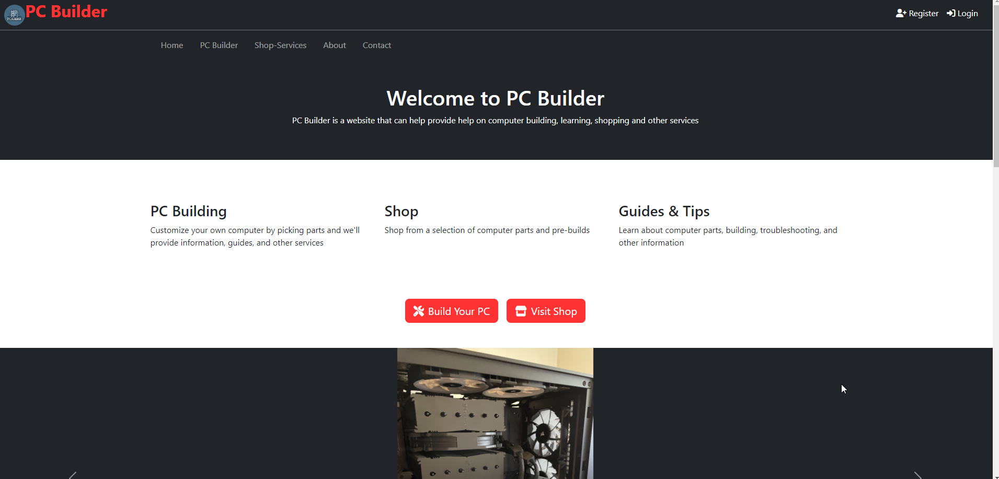
PC Builder page
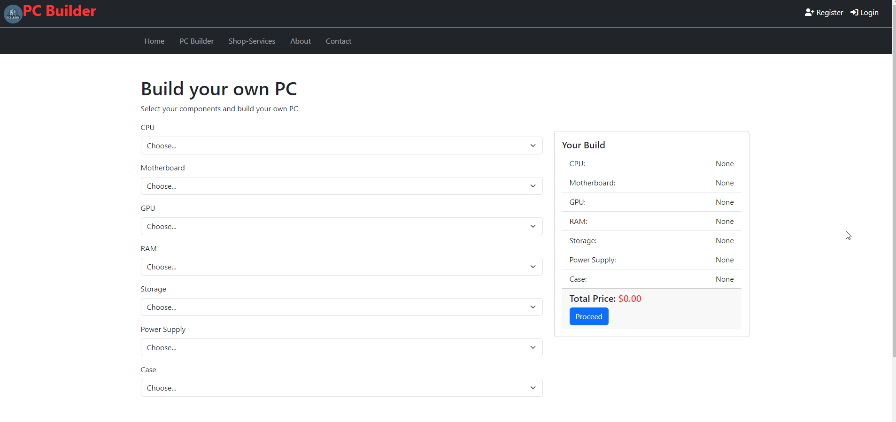
Shop page
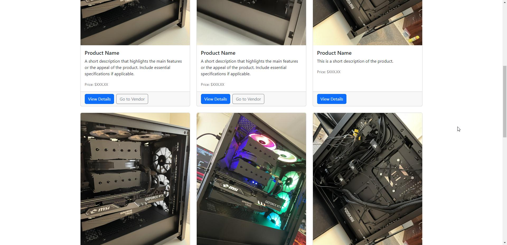
Contact page
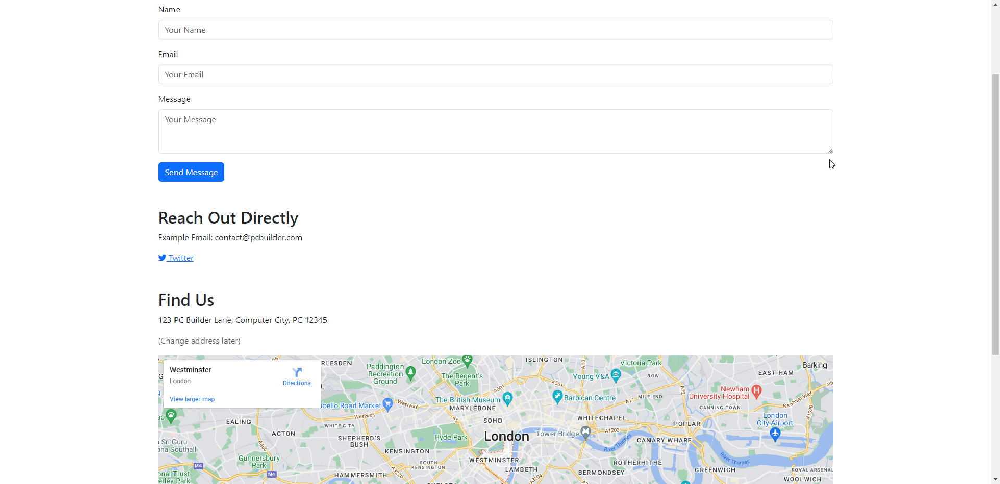

form testing and mongodb backend

    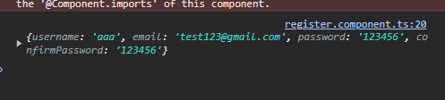
    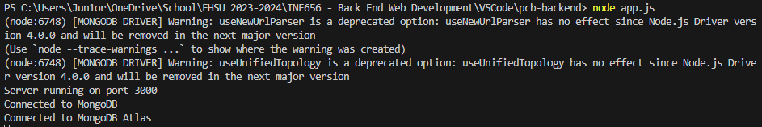

backend and users

    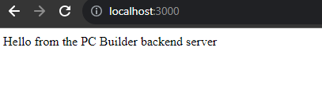
    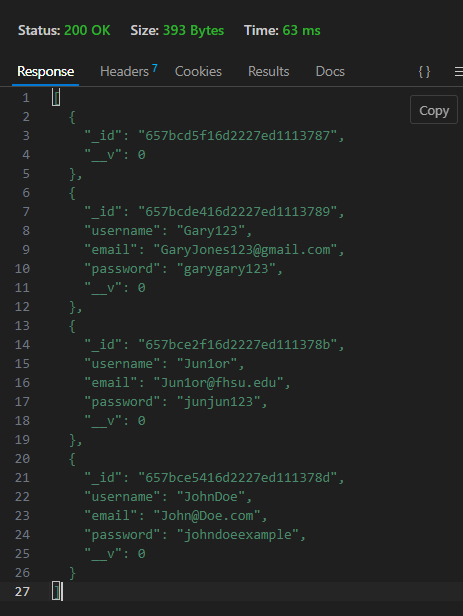

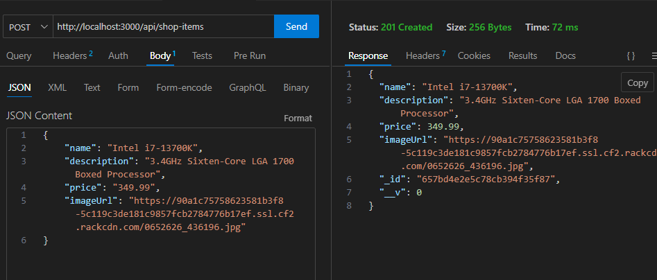
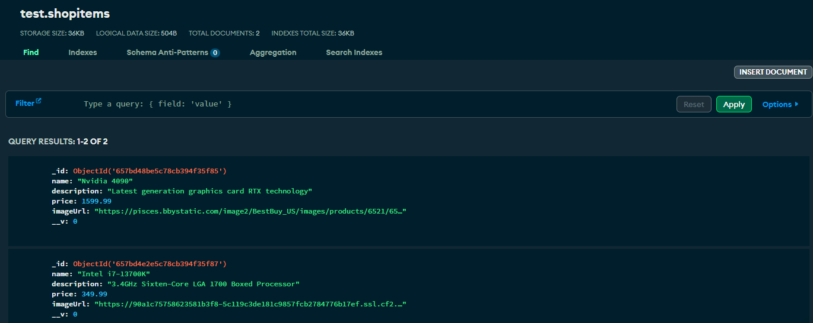

## Future Enhancements

1. Refinement of full site
2. Deployment of the application to a cloud service like AWS for public access
3. Integration of advanced security features like OAuth
4. Development of real-time chat
5. Implementing guides that help along the build process
6. Finishing the PC-Build page for full functionality
7. Full backend to frontend support/connection
8. More pages such as blog, documentation, guides, commenting/chatting section
9. PC-Build page to have a filter and compatibility check support
10. Web scraper or bot to pull items from reputable sources
11. Complete admin dashboard for management
