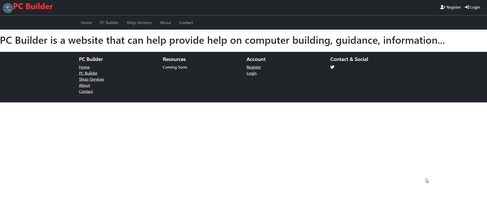
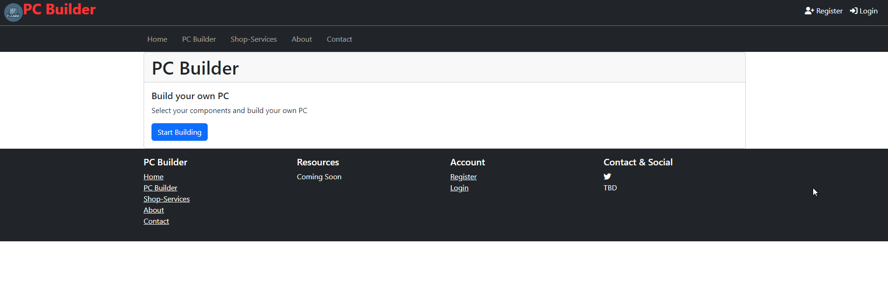

# INF656-Final-Project - MEAN Stack Project

This project is a full-stack web application based on my web development proposal, using MongoDB, Express.js, Anguluar, and Node.js. (About and overview of project)...

## Features

- ...
- ...
- ...

## Built With

- Front-end: Angular framework (using HTML, CSS, and JavaScript, and typescript)...
- Back-end: Express.js framework and Node.js server-side...
- Database: MongoDB a NoSQL...

## Setup and View (I don't know wording)

1. Clone the repository using: `git clone ...`.
2. ...

## Development Roadmap

- [ ] Project Proposal
- [ ] Front-end (Angular)
- [ ] Back-end (Express.js and Node.js)
- [ ] ...
- [ ] Database (MongoDB)
- [ ] ...
- [ ] ...

## Gallery

(inserting screenshots)

initial design of the website

